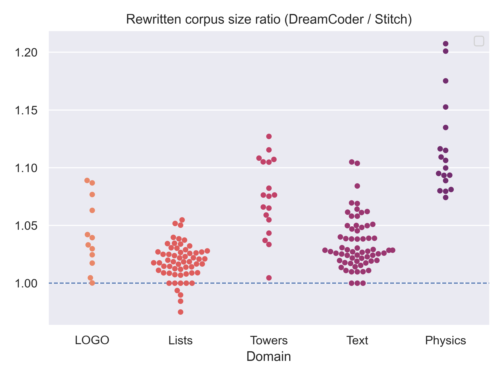
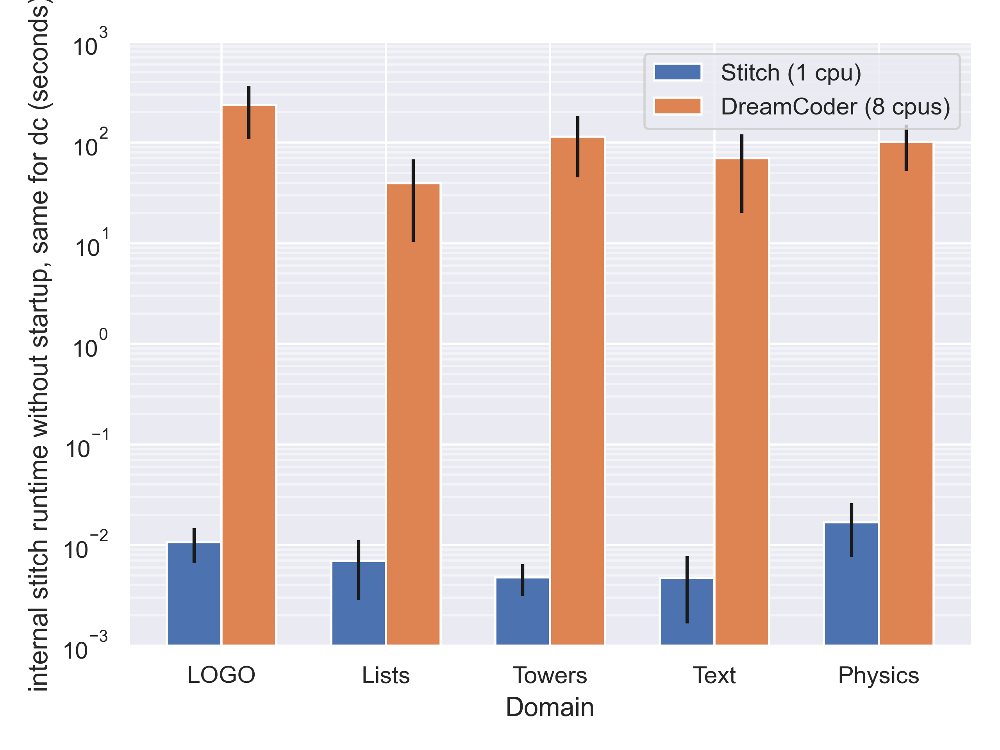
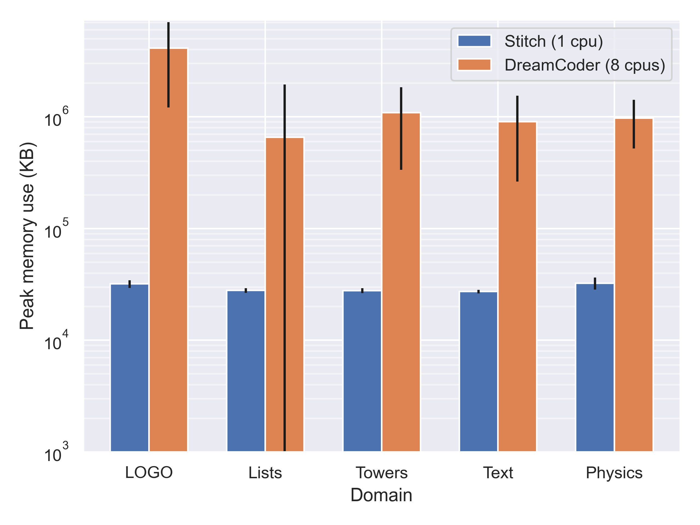
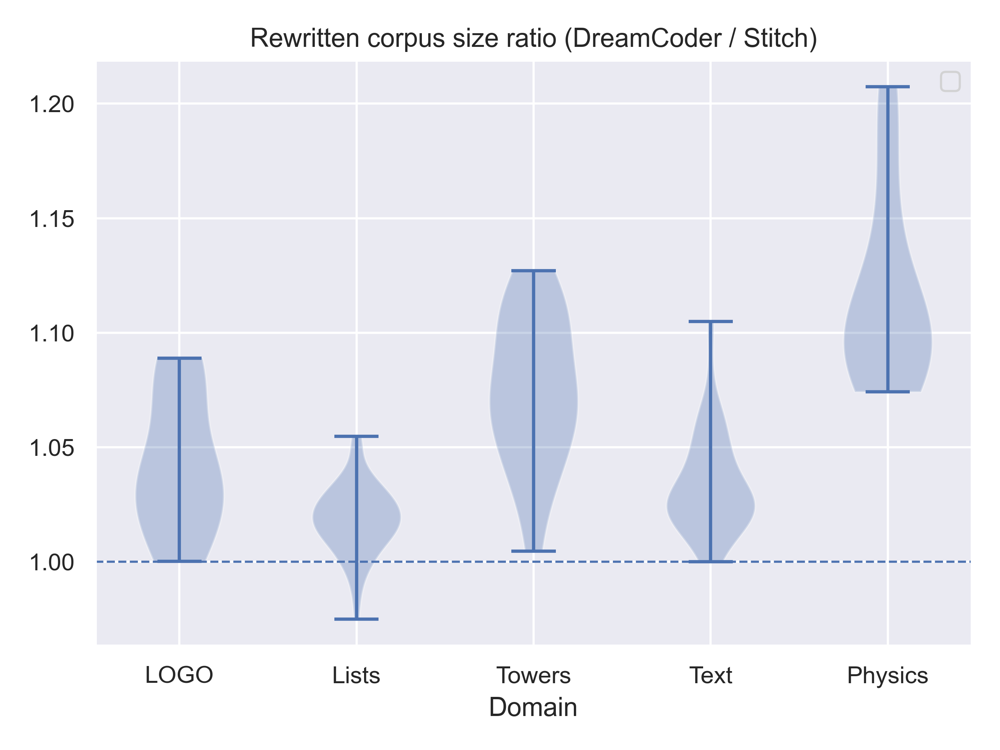
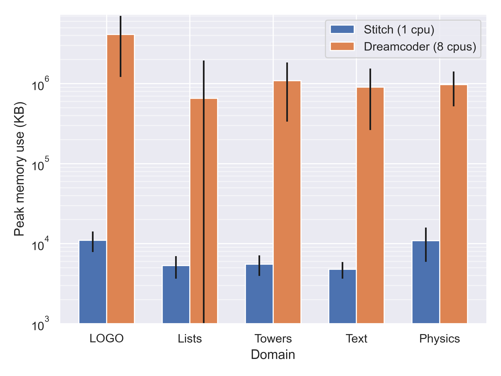
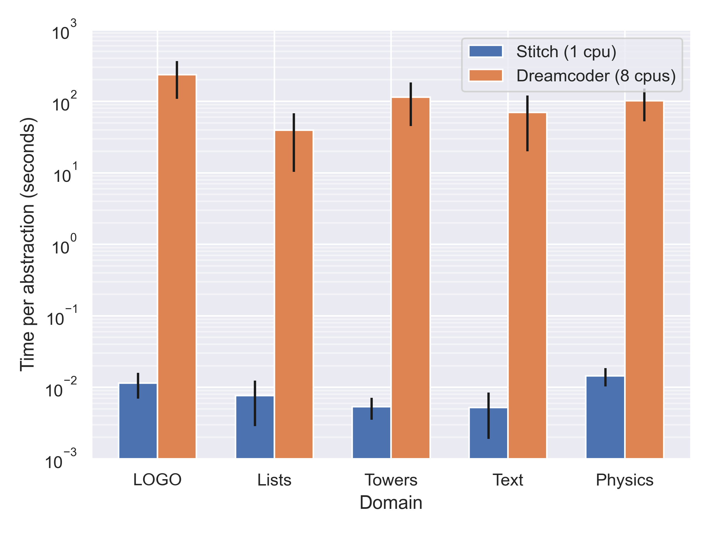
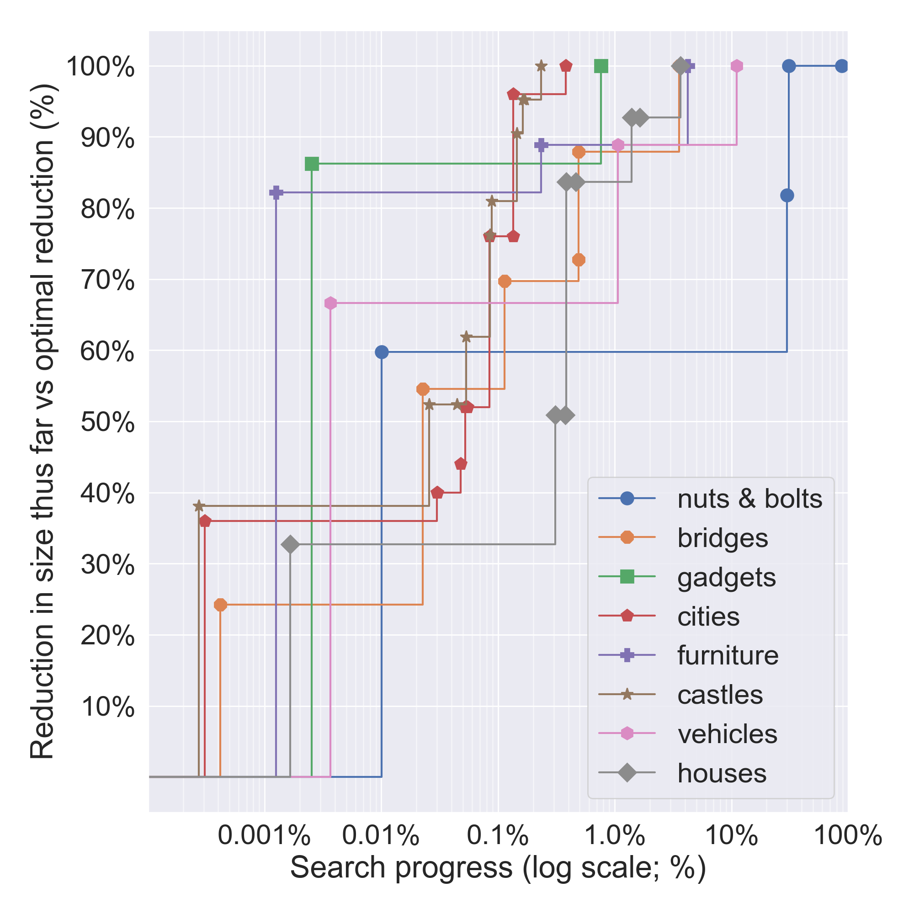

# Testing and Benchmarking Stitch (written Nov 26 2023)

There are two relevant repos, both of which are relevant to running these benchmarks even when only the core version of Stitch is changed:
- stitch: [GitHub - mlb2251/stitch: A scalable abstraction learning library](https://github.com/mlb2251/stitch/)
- stitch_bindings: [GitHub - mlb2251/stitch\_bindings: Bindings for stitch](https://github.com/mlb2251/stitch_bindings/)

Here are the the at-a-glance instructions for comparing two versions of stitch. We'll assume one is pushed as commit `abcd` and the other is pushed as commit `wxyz` (local versions work too, just use `path=` when changing Cargo.toml as explained in detailed instructions).

1. `cd path/to/stitch_bindings`
2. change `Cargo.toml`'s `stitch_core` entry to say `rev = abcd`
3. `make benchmark`. Alt: `make benchmark-minimal` skips slowest two tower domains (total: X min), or `make benchmark-tiny` skips all tower domains (total: 2min).
4. `make plots-old`
5. change `Cargo.toml`'s `stitch_core` entry to say `rev = wxyz`
3. `make benchmark` this will take <10 min. Alt: `benchmark-minimal` skips slowest two tower domains to save 3 minutes, or `benchmark-tiny` skips all tower domains to reduce the whole thing to around 2 minutes.
7. Open `stitch_bindings/experiments/results.html` in a browser to see a comparison of the two.
8. Feel free to rerun individual components for example `make claim-2-tiny SEEDS=5` to rerun `claim-2-tiny` with more seeds if you think something might have been a fluke.

## Detailed instructions

**Pointing stitch_bindings to stitch**
- clone stitch_bindings. Modify `stitch_bindings/Cargo.toml` to replace the `stitch_core = {...}` line with either:
    - `stitch_core = { path = "path/to/stitch"}` if you'd like to use the locally cloned version of stitch (e.g. your in-dev version) or
    - `stitch_core = { git = "https://github.com/mlb2251/stitch", rev = "9a30d03"}` where `rev` is the git commit that you want to use
- Then run `make` (or optionally `PYTHON=python3.8 make` etc for a specific python version)  to install the `stitch_core` library with this version of stitch.
- Now you can run any of the tests or evaluations below.

## Running tests

stitch repo: `make test`
- runs a bunch of tests. In particular, `data/expected_outputs/` has a bunch of expected detailed outputs of compression. For each of these (or rather the subset listed in `tests/integration_tests.rs`) the benchmark is run and compared to the old json. The json fields that are checked for equality are: "original", "original_cost", "final_cost", "compression_ratio", "num_abstractions", "abstractions", and "rewritten". This will catch any changes that cause a difference in which abstractions are generated, the resulting compression ratios, etc.
    - If you want to update the tests, e.g. because your change introduces new abstractions that can be found (with the default flags on), you can run `make test-update` and follow the instructions it gives for copying each expected output over in the cases where they differ.

stitch_bindings repo: `make test`
- runs very minimal tests – just a handful of checks to make sure the bindings themselves are working. You probably want to run the one in the stitch repo as well, given how minimal this is.

## Evaluating Time & Memory on DreamCoder benchmarks (aka Claim-1)


stitch_bindings repo: `make claim-1`

This will write to

```
wrote to experiments/plots/time_per_inv_with_rewrite.png and pdf
wrote to experiments/plots/mem_peak_kb.png and pdf
wrote to experiments/plots/compression_ratio_min.png and pdf
wrote to experiments/plots/binary_runtime.png and pdf
wrote to experiments/plots/runtime_internal.png and pdf
```
Of these graphs you'll want to look at:
- `compression_ratio_min`. This is a swarmplot version of the original violin plot of abstraction quality, measured by comparing how much more stitch can compress the corpus than dreamcoder for a given number of abstractions.
- Runtime:
    - `runtime_internal` and `time_per_inv_with_rewrite`. Both of these are the runtime when you strip away any Python overhead (measured internally in Rust). It's essentially what is used in the paper, and was a fair comparison to DreamCoder. They're pretty identical. `runtime_internal` is extracted from the `dc_comparison_millis` field of the json output of stitch, while `time_per_inv_with_rewrite` is extracted from the "Timing Comparison Point B" printouts of stitch. The former was meant to eventually replace the latter to rely less on printouts for timing comparison. Use either one for your comparison
    - `binary_runtime` This can be ignored. If curious, this sanity check is the wall clock time on the whole binary running, taken at the same points as memory measurement (ie when the subprocess is launched), so this includes python overhead. In practice this isn't a big overhead thankfully.
- `mem_peak_kb`. This is the memory usage. *This includes Python's memory overhead* which raises memory use slightly. The difference is the Rust version gets around 10^4 KB for all benchmarks while the Python version gets around 3 * 10^4 KB for all benchmarks (on M1, and a bit less on Ubuntu as in the paper figures). Instructions are given below for recreating this graph within the pure rust stitch repo – though for most use cases just making sure the Python version stays about the same should be fine. 



Time (runtime_internal):



Memory:




For a version of the memory usage graph that doesn't involve python's memory overhead, you can use the stitch repo's version of `make claim-1`

This will write to (all within `experiments/`):
```
wrote to plots/benches_time_per_inv_with_rewrite.png and pdf
wrote to plots/benches_time_per_inv_no_rewrite.png and pdf
wrote to plots/benches_mem_peak_kb.png and pdf
wrote to plots/benches_compression_ratio_min.png and pdf
```
The other graphs will be identical to the stitch_bindings ones since there's no Python overhead for time measurements which are taken internally in Rust. These are the graphs for the paper, except `benches_time_per_inv_no_rewrite` which doesn't really offer much insight so it can be ignored.

The expected graphs for m1 macs are given in `experiments/expected_plots_m1` as of Nov 26 2023 and are also included below. However to properly evaluate that this claim is consistent you want to run it before and after your change on your own machine since the time and memory stats vary across machines. For reference, here are the graphs from an M1 mac on Nov 26 2023 (note that compared to the paper figures run on an Ubuntu machine, the M1 uses slightly more memory but is slightly faster):





## Evaluating Time & Memory on Wong et al benchmarks (aka Claim-2)

stitch_bindings repo: `make claim-2-minimal`

This is a quick, minimal version of claim-2 that skips the two slowest domains (cities and castles) and runs in around a minute and a half. The table will look a bit like this, where CR = Compression Ratio. These are from an M1 Mac on nov 26 2023:
```
+--------------+-------------------+---------------+--------------+----------------------+
|    Domain    | Training set C.R. | Test set C.R. | Runtime (s)  | Peak mem. usage (MB) |
+--------------+-------------------+---------------+--------------+----------------------+
| nuts & bolts |   11.81 +- 0.16   | 12.15 +- 0.70 | 0.12 +- 0.00 |    39.02 +- 2.94     |
|   gadgets    |    3.96 +- 0.01   |  3.65 +- 0.18 | 1.04 +- 0.02 |    89.28 +- 2.15     |
|  furniture   |    4.95 +- 0.06   |  4.82 +- 0.30 | 1.53 +- 0.02 |    101.64 +- 6.24    |
|   vehicles   |    4.26 +- 0.05   |  4.19 +- 0.10 | 0.81 +- 0.01 |    81.86 +- 3.17     |
|   bridges    |    4.36 +- 0.05   |  4.28 +- 0.21 | 9.66 +- 0.19 |   401.17 +- 12.66    |
|    houses    |    8.76 +- 0.27   |  8.99 +- 0.23 | 7.25 +- 0.10 |    486.35 +- 8.30    |
+--------------+-------------------+---------------+--------------+----------------------+
```

stitch_bindings repo: `make claim-2`

This takes around 4 and a half minutes and yields (nov 26 2023 on M1 mac):
```
+--------------+-------------------+---------------+---------------+----------------------+
|    Domain    | Training set C.R. | Test set C.R. |  Runtime (s)  | Peak mem. usage (MB) |
+--------------+-------------------+---------------+---------------+----------------------+
| nuts & bolts |   11.81 +- 0.16   | 12.15 +- 0.70 |  0.12 +- 0.00 |    41.58 +- 2.00     |
|   gadgets    |    3.96 +- 0.01   |  3.65 +- 0.18 |  1.01 +- 0.05 |    95.56 +- 5.92     |
|  furniture   |    4.95 +- 0.06   |  4.82 +- 0.30 |  1.63 +- 0.12 |    106.91 +- 1.56    |
|   vehicles   |    4.26 +- 0.05   |  4.19 +- 0.10 |  0.81 +- 0.01 |    86.17 +- 3.37     |
|   bridges    |    4.36 +- 0.05   |  4.28 +- 0.21 |  9.17 +- 0.24 |   419.22 +- 24.81    |
|    cities    |    3.19 +- 0.04   |  3.05 +- 0.09 | 22.69 +- 0.44 |   807.45 +- 29.47    |
|   castles    |    2.58 +- 0.05   |  2.55 +- 0.06 | 36.10 +- 2.43 |   1322.61 +- 97.55   |
|    houses    |    8.76 +- 0.27   |  8.99 +- 0.23 |  7.21 +- 0.06 |    534.90 +- 5.62    |
+--------------+-------------------+---------------+---------------+----------------------+
```
and `make claim-2 SEEDS=3` can be used to specify how many replications to run. The paper used 50 seeds, and the default is 3 seeds.

Note that these numbers differ a bit from the original paper. M1s are faster but use more memory than the Ubuntu machine in the paper. As for the compression ratios, these both vary from the paper because fewer samples are used here, and the values have gradually changed since the original paper implementation due to various improvements or small changes that result in different choices of equal-utility abstractions that have downstream effects, etc (see artifact for reproducing original). In general, when making changes you want to compare your table to the table you get by running the same command on the pre-change branch.

stitch repo: `make claim-2`
- Do not use this. We've ported it over to the stitch-bindings repo since newer versions of stitch dont have the train-test split format option since that's not something that really belongs in the core library (and instead can easily be inplemented in wrapper rust/python/etc). In `experiments/analyze.py` there was a brief in-development version of claim-2 that used the locally installed copy of `stitch-core`, though this doesnt make much sense to call from within the rust repo. In general, it just makes more sense to evaluate this claim from the bindings repo while pointing it to the rust repo that you want used under the hood.


## Evaluating Anytime Behavior (aka Claim-3)

stitch repo: `make claim-3` 
This will write to `experiments/plots/claim-3.png` and on nov 26 2023 looks like:



This hasn't been ported over the the stitch_bindings repo.


## Ablations (claim-4)
See original artifact for how these were done – they may well still work in the current stitch repo, but are extremely long-running and likely not something you actually want to do.


